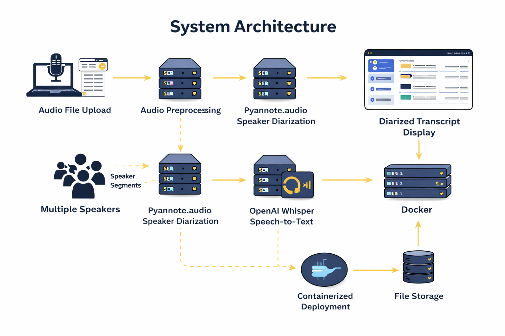
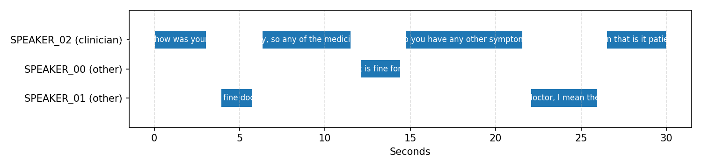
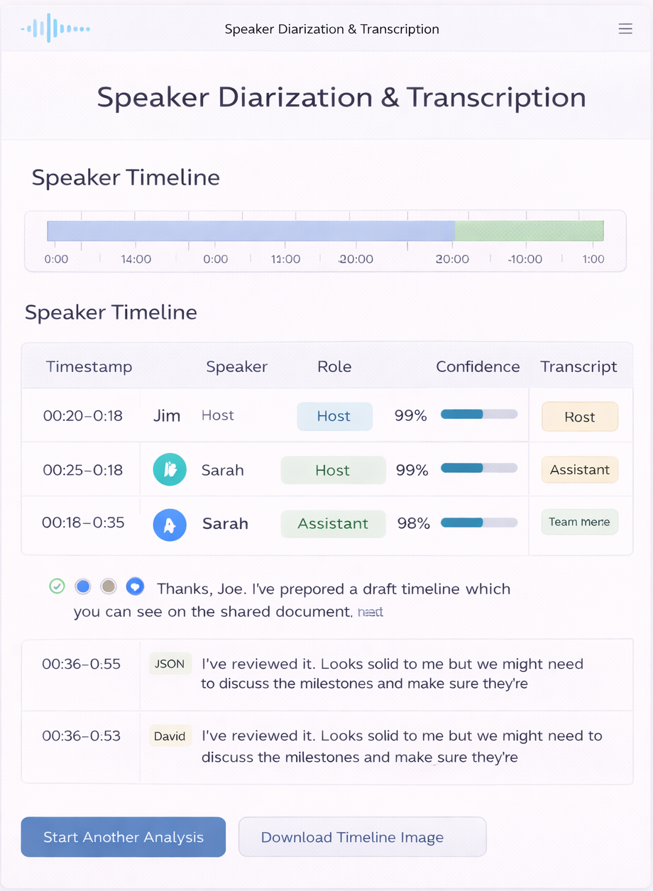

## Speaker Diarization with Transcription in Multispeaker Audio
Speaker Diarization with Transcription in Multispeaker Audio is an AI-based system designed to automatically identify who spoke when in an audio recording and generate accurate, speaker-labeled transcripts, enabling structured analysis of multi-speaker conversations.

## About
Speaker Diarization with Transcription in Multispeaker Audio is a project that integrates advanced deep learning techniques to analyze audio recordings containing multiple speakers. Traditional speech-to-text systems produce unstructured transcripts without distinguishing speakers, making conversation analysis difficult in meetings, interviews, podcasts, and call recordings.

This project addresses these challenges by combining speaker diarization and speech-to-text transcription into a single automated pipeline. The system detects speaker boundaries, segments audio based on different speakers, and converts each segment into text with clear speaker attribution. The application is designed to be user-friendly, scalable, and deployable through a web interface.

## Features
* Automatic identification of multiple speakers in an audio file

* Speaker-labeled transcription for clear conversation understanding

* Robust performance in noisy and real-world audio conditions

* Web-based interface for easy audio upload and result visualization

* Scalable and portable deployment using containerization

* Reduced manual effort and faster analysis compared to traditional methods

## Requirements
* Operating System: 64-bit OS (Windows 10 / Ubuntu)

* Programming Language: Python 3.8 or later

* Speaker Diarization Framework: Pyannote.audio

* Speech-to-Text Model: OpenAI Whisper

* Speaker Embedding Framework: SpeechBrain

* Web Framework: Streamlit

* Containerization: Docker

* Version Control: Git

* IDE: VS Code / PyCharm

* Additional Dependencies: NumPy, PyTorch, torchaudio

## System Architecture

## Output

#### Output1 - Timeline and Speakers Identification

#### Output2 - Transcription download

## Results and Impact
The Speaker Diarization with Transcription system significantly improves the usability of speech analysis by converting unstructured audio into structured, speaker-aware text. It reduces manual transcription effort, enhances clarity in multi-speaker conversations, and supports efficient analysis of meetings, interviews, and call-center recordings.

The project demonstrates the effectiveness of modern deep learning frameworks in real-world audio processing and provides a scalable foundation for future extensions such as real-time diarization, speaker identification, and multilingual transcription.

## Articles published / References
1. Fujita, Yusuke, et al. "End-to-end neural speaker diarization with permutation-free objectives." arXiv preprint arXiv:1909.05952 (2019).
2. Singh, Prachi, Amrit Kaul, and Sriram Ganapathy. "Supervised hierarchical clustering using graph neural networks for speaker diarization." ICASSP 2023-2023 IEEE International Conference on Acoustics, Speech and Signal Processing (ICASSP). IEEE, 2023.
